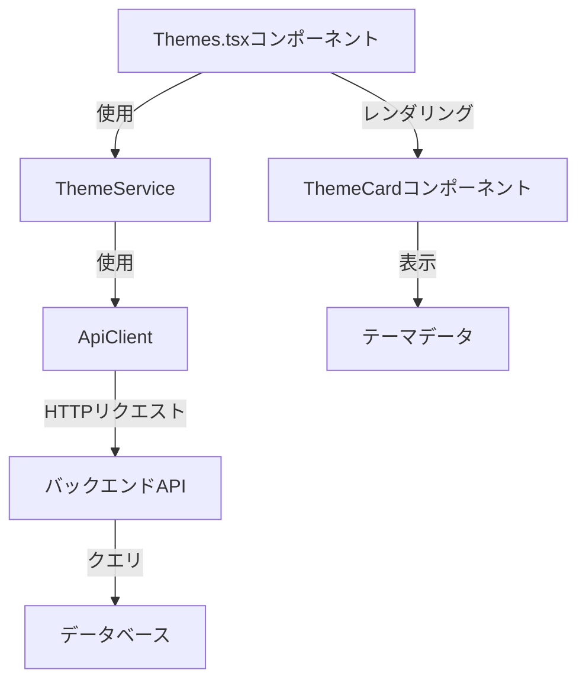

# テーマデータ取得モジュール設計

## 1. 概要

このドキュメントでは、`frontend/src/pages/Themes.tsx`でテーマをデータベースから取得するためのモジュール設計について説明します。既存の API クライアントを使用してテーマを取得し、ローディング状態とエラー状態を適切に処理し、Themes.tsx コンポーネントが期待する形式でデータを提供します。

## 2. アーキテクチャ図



## 3. モジュールコンポーネント

### 3.1. テーマ型の拡張

既存の Theme 型を拡張して、カウント情報を含めます：

```typescript
// カウント情報を含む拡張されたTheme型
interface ThemeWithCounts extends Theme {
  keyQuestionCount: number;
  commentCount: number;
  description: string; // descriptionが含まれていることを確認
}
```

### 3.2. テーマサービス

テーマ関連の操作を処理するサービスモジュールを作成します：

```typescript
// ThemeService.ts
import { apiClient } from "./apiClient";
import type { Theme, ThemeWithCounts } from "../types";

export class ThemeService {
  // カウント情報を含むすべてのテーマを取得
  static async getAllThemes(): Promise<ThemeWithCounts[]> {
    const result = await apiClient.getAllThemes();

    if (result.isErr()) {
      throw result.error;
    }

    return result.value as ThemeWithCounts[];
  }

  // カウント情報を含む単一のテーマを取得
  static async getThemeById(id: string): Promise<ThemeWithCounts> {
    const result = await apiClient.getThemeById(id);

    if (result.isErr()) {
      throw result.error;
    }

    return result.value as ThemeWithCounts;
  }
}
```

### 3.3. テーマフック

コンポーネントで使用するカスタムフックを作成します：

```typescript
// useThemes.ts
import { useState, useEffect } from "react";
import { ThemeService } from "../services/ThemeService";
import type { ThemeWithCounts } from "../types";
import { ApiError } from "../services/api/apiError";

interface UseThemesResult {
  themes: ThemeWithCounts[];
  loading: boolean;
  error: ApiError | null;
  refetch: () => Promise<void>;
}

export function useThemes(): UseThemesResult {
  const [themes, setThemes] = useState<ThemeWithCounts[]>([]);
  const [loading, setLoading] = useState<boolean>(true);
  const [error, setError] = useState<ApiError | null>(null);

  const fetchThemes = async () => {
    setLoading(true);
    setError(null);

    try {
      const fetchedThemes = await ThemeService.getAllThemes();
      setThemes(fetchedThemes);
    } catch (err) {
      setError(err as ApiError);
    } finally {
      setLoading(false);
    }
  };

  useEffect(() => {
    fetchThemes();
  }, []);

  return { themes, loading, error, refetch: fetchThemes };
}
```

### 4. バックエンドの修正（必要）

バックエンドを修正して、Theme レスポンスに`keyQuestionCount`と`commentCount`を含める必要があります。これには以下が含まれます：

1. Theme モデルの修正、またはこれらのカウントを含む DTO（Data Transfer Object）の作成
2. コントローラーを更新して、これらのカウントを取得してレスポンスに含める

```javascript
// themeController.jsの修正例
export const getAllThemes = async (req, res) => {
  try {
    const themes = await Theme.find({ isActive: true }).sort({ createdAt: -1 });

    // テーマにカウント情報を追加
    const enhancedThemes = await Promise.all(
      themes.map(async (theme) => {
        const themeObj = theme.toObject();

        // このテーマのキークエスチョンをカウント
        const keyQuestionCount = await SharpQuestion.countDocuments({
          themeId: theme._id,
        });

        // このテーマのコメントをカウント
        const commentCount = await Comment.countDocuments({
          themeId: theme._id,
        });

        return {
          ...themeObj,
          keyQuestionCount,
          commentCount,
        };
      })
    );

    res.status(200).json(enhancedThemes);
  } catch (error) {
    console.error("Error fetching all themes:", error);
    res
      .status(500)
      .json({ message: "Error fetching themes", error: error.message });
  }
};
```

### 5. Themes.tsx での実装

Themes.tsx コンポーネントを更新して新しいフックを使用します：

```typescript
import { useRef } from "react";
import {
  FloatingChat,
  type FloatingChatRef,
} from "../components/chat/FloatingChat";
import BreadcrumbView from "../components/common/BreadcrumbView";
import ThemeCard from "../components/home/ThemeCard";
import { useThemes } from "../hooks/useThemes";

const Themes = () => {
  const breadcrumbItems = [
    { label: "TOP", href: "/" },
    { label: "テーマ一覧", href: "/themes" },
  ];

  const chatRef = useRef<FloatingChatRef>(null);
  const { themes, loading, error } = useThemes();

  const handleSendMessage = (message: string) => {
    console.log("Message sent:", message);

    setTimeout(() => {
      chatRef.current?.addMessage("メッセージを受け取りました。", "system");
    }, 500);
  };

  return (
    <div className="container mx-auto px-4 py-8">
      <BreadcrumbView items={breadcrumbItems} />

      <h1 className="text-2xl md:text-3xl font-bold mb-4">議論テーマ一覧</h1>

      <p className="text-sm text-neutral-600 mb-8">
        全国から寄せられた多様な意見をもとに、重要な社会課題について議論するテーマを設定しています。
        関心のあるテーマに参加して、あなたの声を政策づくりに活かしましょう。
      </p>

      {loading && (
        <div className="text-center py-8">
          <p>テーマを読み込み中...</p>
        </div>
      )}

      {error && (
        <div className="bg-red-100 text-red-700 p-4 rounded-lg mb-8">
          <p>エラーが発生しました: {error.message}</p>
        </div>
      )}

      {!loading && !error && (
        <div className="grid grid-cols-1 gap-4 mb-12">
          {themes.map((theme) => (
            <ThemeCard
              key={theme._id}
              id={theme._id}
              title={theme.title}
              description={theme.description}
              keyQuestionCount={theme.keyQuestionCount}
              commentCount={theme.commentCount}
            />
          ))}
        </div>
      )}

      <FloatingChat ref={chatRef} onSendMessage={handleSendMessage} />
    </div>
  );
};

export default Themes;
```

## 6. エラー処理とエッジケース

1. **空のテーマリスト**: テーマが利用できない場合にメッセージを表示
2. **ローディング状態**: データ取得中にローディングインジケータを表示
3. **エラー状態**: API リクエストが失敗した場合にエラーメッセージを表示
4. **リトライメカニズム**: 失敗したリクエストを再試行する方法を提供

## 7. 将来の拡張（今回は実装しなくていいこと）

1. **ページネーション**: リストが大きくなった場合にテーマをページング処理するサポートを追加
2. **フィルタリング/ソート**: ユーザーがテーマをフィルタリングおよびソートできるようにする
3. **キャッシング**: パフォーマンスを向上させるためにキャッシングを実装

## 8. まとめ

この設計は、ローディング状態とエラー状態を適切に処理しながら、データベースからテーマを取得するための保守性が高くスケーラブルなソリューションを提供します。バックエンドの修正が必要ですが、これにより、フロントエンドは必要なすべてのデータを効率的に取得できるようになります。
